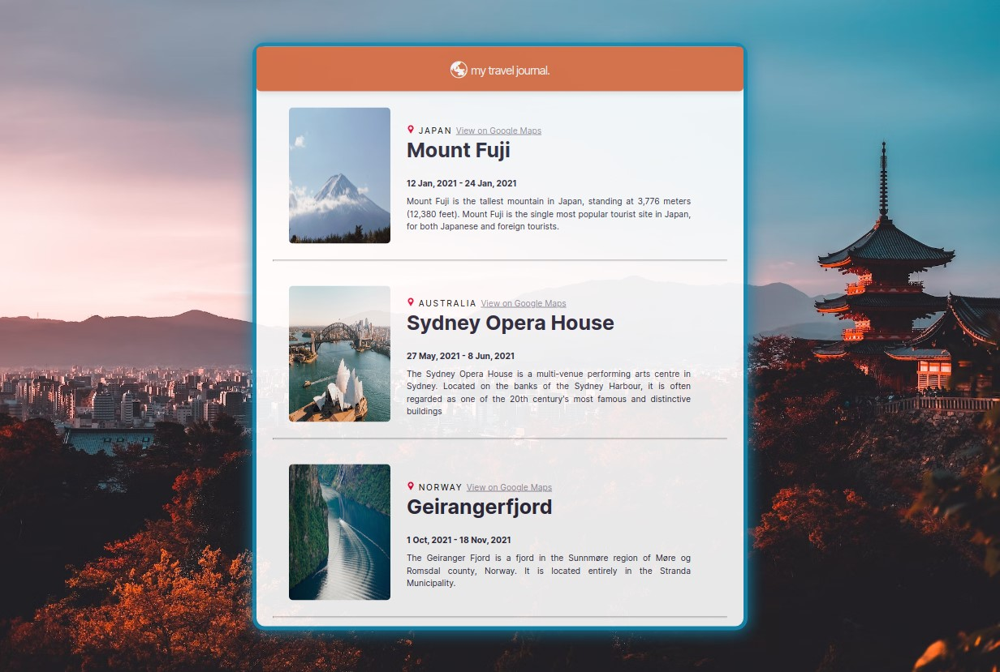

# Travel Journal
A travel journal website to highlight places that you want to travel, the second personal project under [Learn React at Scrimba](https://scrimba.com/learn/learnreact).

## Table of contents
- [Introduction](#introduction)
- [Overview](#overview)
  - [Screenshot](#screenshot)
  - [Built using](#built-using)
  - [Lessons Applied](#lessons-applied)
- [Author](#author)
- [Acknowledgement](#acknowledgement)

## Introduction
- This is my solution to the second solo project of [Learn React](https://scrimba.com/learn/learnreact).
- This webpage was setup using [Vite](https://vitejs.dev/).
- This webpage features:
    - Reusable components
    - Mapping components

## Overview
- Link: [github.com/kierhb/travel-journal](https://github.com/kierhb/travel-journal)

### Screenshot

### Built using

- HTML5 markup
- CSS
- Vanilla JavaScript
- ReactJS

### Lessons Applied:

- Setting up the React application with the use of Vite.
- Reusing components by receiving mapped props.
- Pass object as props.
- Spread object as props.

## Author

- GitHub - [@kierhb](https://github.com/kierhb)
- LinkedIn - [Kier Bobila](https://www.linkedin.com/in/kier-bobila/)

## Acknowledgement
- I want to acknowledge the course instructor Bob Ziroll and to all members of Scrimba community.

- Photos from Unsplash:

    - [Japan](https://source.unsplash.com/WLxQvbMyfas)

    - [Australia](https://source.unsplash.com/JmuyB_LibRo)

    - [Norway](https://source.unsplash.com/3PeSjpLVtLg)

- [Background](https://images.unsplash.com/photo-1545569341-9eb8b30979d9?ixlib=rb-4.0.3&ixid=MnwxMjA3fDB8MHxwaG90by1wYWdlfHx8fGVufDB8fHx8&auto=format&fit=crop&w=2070&q=80)